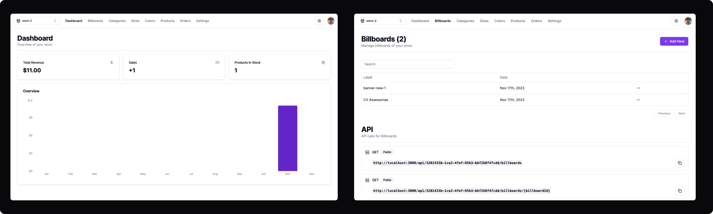

# ShopPilot - Admin -- [Live Demo](https://shoppilot-admin.vercel.app)
ShopPilot is a Web CMS (Content Manager System) platform to manages and feeds any application that needs dynamic data.
<br /><br />



## # Purpose
The purpose of this project initially was to learn and practice a new stack (Next.js 13) and also create an MVP (Minimum viable product) to solve some problems that a friend presented to me when we discussed his company (e-commerce). However, throughout the development, I realized that many of the features I was creating are very common features to have in any type of software, so I realized that I could go beyond that goal and create a template application. In other words, an application where I can reuse it as needed.<br />For example, if a project/freelancer appears that needs software with similar functionalities or really needs a CMS, I will already have the software ready.

## # Stage and Next Steps
The current phase of the project is already in production, launched in version `1.0.0` with the main features completed.<br />
Additionally, I created a simple e-commerce - You can check it out [here](https://github.com/carlosdevv/shoppilot-store) - just to show the data created on this platform.<br />
The next step will be to refactor the resources to meet the needs of my friend's company.<br />
Maybe soon, I can transform this project into a SaaS and make it generic to support any type of application.

### # Technologies used
- Next.js
- TailwindCss
- Prisma
- Clerk auth
- Zustand
- Axios
- shadcn-ui
- Recharts
- Stripe

### # To improve
The project has some features and fixes that I want to improve in the next versions:
- [ ] Add Eslint
- [ ] Organize the architecture adding custom hooks for the components
- [ ] Create CI/CD Pipeline
- [ ] Add trPC
<br /><br />
### Run the project
This project was created using [Next.js](https://nextjs.org/)
<br />

First, install the deps and run the development server:
<br />
```bash
npm install 
# or
yarn install
# or
pnpm i
```
Then, run the project:
```bash
npm run dev
# or
yarn dev
# or
pnpm dev
```

Open [http://localhost:3000](http://localhost:3000) with your browser to see the result.
